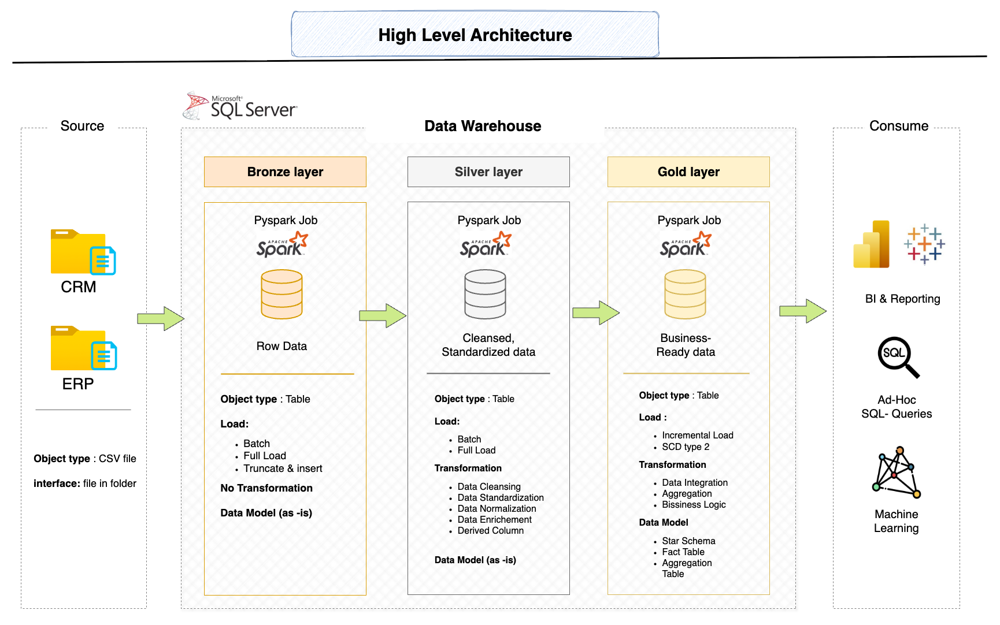

# DWH and analytics project

Welcome to the **Data Warehouse and Analytics Project** repository! 🚀
This project demonstrates a comprehensive data warehousing and analytics solution, from building a data warehouse & implementing Slow-changing-dimension type 2 to track the change in source and to generate actionable insights. Designed as a portfolio project, it highlights industry best practices in data engineering and analytics.

---
## 📊 Data Architecture
The data architecture for this project follows Medallion Architecture **Bronze**, **Silver**, and **Gold layers**

1. **Bronze Layer**: Stores raw data as-is from the source systems. Data is ingested from CSV Files into SQL Server Database by ***PySpark Job***.
2. **Silver Layer**: This layer includes data cleansing, standardization, and normalization processes to prepare data for analysis by ***PySpark Job***.
3. **Gold Layer**: Houses business-ready data modeled into a star schema required for reporting and analytics.

---
## **📖 Project Overview**
This project involves:

1. **Data Architecture**: Designing a Modern Data Warehouse Using _Medallion Architecture Bronze, Silver, and Gold layers_.
2. **ETL Pipelines**: Extracting, transforming, and loading data from source systems into the warehouse using ***PySpark***.
3. **Data Modeling**: Developing fact and dimension tables optimized for analytical queries.
4. **Analytics & Reporting**: Creating SQL-based reports and dashboards for actionable insights.

---
## 🛠️ **Important tools and steps**
1. **Datasets**: Access to the project dataset (CSV files).
2. **SQL Server**: Lightweight server for hosting your SQL database.
3. **PySpark**: for Building Pipeline [ Extract, Transform, Load, SCD type 2 ]
3. **Visual Studio Code**: GUI for managing and interacting with databases and building Pipelines using Spark.
4. **DrawIO**: Design data architecture, models, flows, and diagrams.
5. **Notion**: Build Project Roadmap and steps.

---

